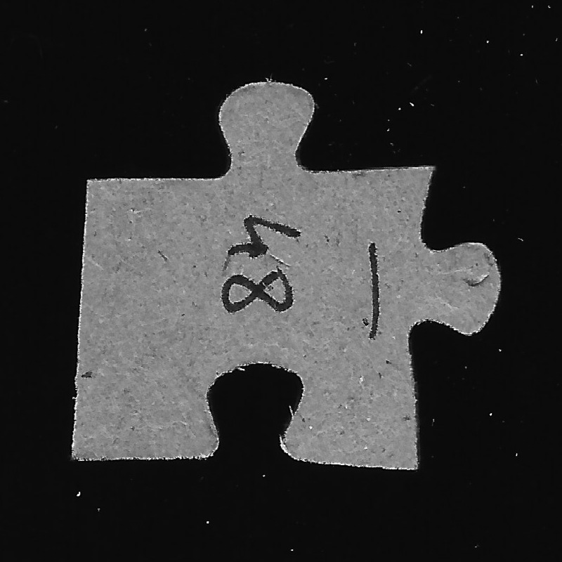
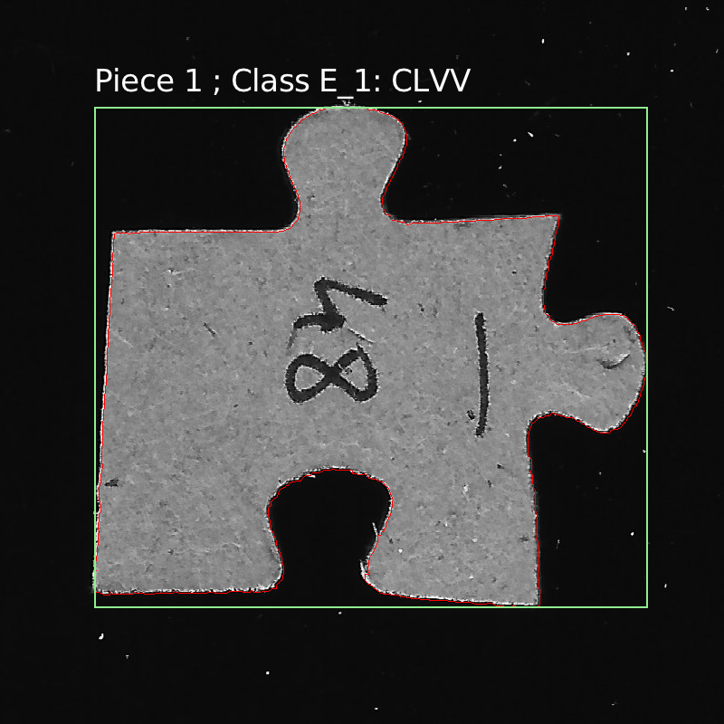

# GPU-Accelerated Jigsaw Puzzle Piece Detection

GPU Architecture & Computing, SS2026, Group 2.

Eight-stage computer vision pipeline that detects and classifies jigsaw puzzle pieces in images. Implemented as a serial C++ baseline and a parallel CUDA variant.

| Input | Output |
|:-----:|:------:|
|  |  |

## Team

| Name | GitHub | Task |
|:-----|:-------|:-----|
| Jakob Olsacher | jacky6134 | **1 — Preprocessing:** grayscale conversion, Gaussian blur, Otsu threshold |
| Ananthalakshmi Vinod Iyer | ananthaiyer | **2 — Segmentation:** morphological cleaning, connected components, boundary extraction |
| Philipp Sepin | p0017 | **3 — Contour Extraction & Distance:** contour tracing, simplification, enclosing circle, radial signal |
| Jan-Hill Arganda | BeginnerCoderEurope | **4 — Signal Analysis:** signal smoothing, peak detection, edge classification |
| Tobias Ponesch | AlbertZweistein-2 | **5 — Classification, Visualization & Integration:** lookup table, drawing, pipeline orchestration, benchmarking |

## Pipeline

```
preprocessing → cleaning → component_labeling → boundary_extraction
→ contour_to_signal → signal_analysis → classification → visualization
```

Each stage has a serial C++ and, if possible, a parallel CUDA implementation.

## Build

Both scripts live in the repo root and require no CMake. Variables can be overridden via the environment.

#### Serial (local / cluster)

```bash
./build_serial.sh
```

#### CUDA (cluster)

```bash
./build_cuda.sh
```

Build flags:

| Flag | Default | Effect |
|:-----|:--------|:-------|
| `DEBUG` | `0` | enable verbose logging |
| `TIMINGS` | `1` | measure per-stage runtimes |
| `PERSIST_TIMINGS` | `0` | append timing results to CSV |
| `NVTX` | `0` | emit Nsight Systems stage ranges |
| `ARCH` | `sm_75` | CUDA target architecture|

Example: `TIMINGS=1 DEBUG=0 NVTX=1 ./build_cuda.sh`

## Run

#### Serial (local / cluster)

```bash
./build/pipeline data/1_p1.jpg data/pipeline_output
```

#### CUDA (cluster)

```bash
./build/pipeline_cuda data/1_p1.jpg data/pipeline_output
```

#### CUDA profiling

```bash
./profile_cuda.sh data/single.JPG test_output
```

## Cluster Access

```bash
ssh bastion
ssh gpu3vm2
```
